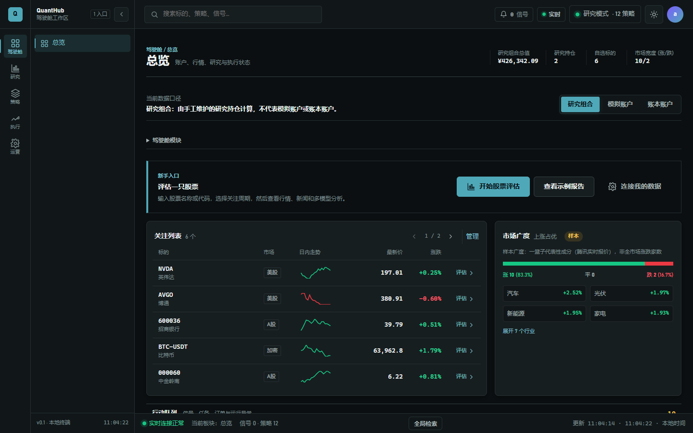

# QuantHub

> 面向个人投资者与量化研究者的多市场量化研究、策略验证和模拟交易工作台。

QuantHub 将行情研究、股票评估、新闻与价格行为分析、策略回测、信号审核、模拟执行、组合账本和运行治理整合到一个本地优先的 Web 应用中。项目采用 React + FastAPI，支持 A 股、加密资产与 MT5 数据，并通过插件机制扩展策略。




> [!WARNING]
> QuantHub 当前定位为研究与模拟执行工具，实盘交易默认关闭。项目输出不构成任何投资建议；在接入真实账户前，请自行完成数据、策略、风控和合规验证。

## 为什么使用 QuantHub

- **一站式研究流程**：从标的搜索、行情查看、新闻分析和 PA 分析，到策略判断与研究记录。
- **多市场统一工作台**：统一管理 A 股、加密资产和 MT5 数据及策略。
- **插件式策略系统**：策略独立注册，共享行情、信号、回测、LLM 与告警能力。
- **审核优先的执行链路**：信号先进入审核中心，再进入模拟订单与账户账本。
- **本地优先与安全默认值**：默认使用本地 SQLite，密钥只从环境变量读取，实盘开关默认关闭。
- **完整运营视角**：提供自动化任务、故障状态、备份、访问治理和运行健康检查。
- **新手 / 高级界面模式**：新手模式聚焦股票评估与模拟执行，高级模式开放完整研究和策略工作区。

## 功能概览

| 工作区 | 主要能力 |
| --- | --- |
| 驾驶舱 | 账户净值、持仓、自选、行情状态、行动队列与 PA 决策摘要 |
| 研究 | 股票评估、新闻分析、价格行为分析、分析任务与提醒中心 |
| 策略 | 策略库、策略实验室、回测、多模型判断与策略分配 |
| 执行 | 信号审核、模拟订单、成交记录、持仓与资金账本 |
| 运营 | 标的主数据、自动化、故障状态、备份、成员权限与系统配置 |

内置策略覆盖情绪分析、新闻扫描、选股、SuperTrend、早报、实时分析、OKX 网格、AlphaGPT、PA Agent 和 AlphaMaster 等方向。

## 技术栈

- 前端：React 18、TypeScript、Vite、React Router、Vitest
- 后端：FastAPI、Pydantic、SQLAlchemy、Alembic
- 数据：Pandas、NumPy、PyArrow、SQLite / PostgreSQL
- 工程：uv workspace、插件式策略、领域化 API、PowerShell 启停脚本

## 快速开始

### 环境要求

- Python 3.11 或 3.12
- Node.js 18+
- [uv](https://docs.astral.sh/uv/)
- Windows 一键启动需要 PowerShell

### 1. 获取项目

```bash
git clone https://github.com/<your-name>/quanthub.git
cd quanthub
```

将 `<your-name>` 替换为仓库所有者名称。

### 2. Windows 一键启动

启动脚本会检查运行环境、同步依赖、检查端口与 API 健康状态，并将日志写入 `logs/launcher/`。

```powershell
powershell -ExecutionPolicy Bypass -File tools/start-quanthub.ps1
```

启动完成后访问：

- Web 工作台：<http://127.0.0.1:5173>
- API 文档：<http://127.0.0.1:8001/docs>
- 健康检查：<http://127.0.0.1:8001/health>

停止由脚本启动的服务：

```powershell
powershell -ExecutionPolicy Bypass -File tools/stop-quanthub.ps1
```

已完成依赖安装时，可使用 `-SkipSync` 加快启动：

```powershell
powershell -ExecutionPolicy Bypass -File tools/start-quanthub.ps1 -SkipSync
```

### 3. 手动启动

安装基础依赖：

```bash
uv sync --locked
npm --prefix web install
```

启动 API：

```bash
uv run uvicorn apps.api.main:app --host 127.0.0.1 --port 8001
```

另开一个终端启动前端：

```bash
npm --prefix web run dev
```

Vite 会将 `/api` 请求代理到 `http://127.0.0.1:8001`。

### 4. Docker 镜像

正式版本会发布到 GitHub Container Registry。镜像在同一端口提供 Web 工作台和 API，并将 SQLite 数据持久化到 `/data`：

```bash
docker run --name quanthub -p 8080:8080 -v quanthub-data:/data ghcr.io/1634594707/quanthub:latest
```

启动后访问 <http://127.0.0.1:8080>，健康检查位于 <http://127.0.0.1:8080/health>。

## 可选能力

基础安装足以启动 Web 工作台。需要特定市场或分析能力时，再安装对应 extra：

```bash
# A 股数据与中文情绪分析
uv sync --locked --extra a_shares

# 加密资产数据源
uv sync --locked --extra crypto

# OpenAI 兼容 LLM 能力
uv sync --locked --extra ai

# Backtrader 回测引擎
uv sync --locked --extra backtest
```

多个能力可以在同一条命令中组合，例如：

```bash
uv sync --locked --extra a_shares --extra ai --extra backtest
```

## 配置

### 本地环境变量

基础功能无需 API Key。若要启用真实的 AI 分析，复制环境变量模板并填写自己的密钥：

```powershell
Copy-Item apps/api/.env.example apps/api/.env
```

```dotenv
DEEPSEEK_API_KEY=your-key-here
```

`apps/api/.env` 已被 Git 忽略。请勿将 API Key、数据库密码、交易所密钥或访问令牌提交到仓库。

### 主要配置文件

| 文件 | 用途 |
| --- | --- |
| `configs/base.yaml` | 全局开关、缓存、信号权重、告警、LLM 与回测配置 |
| `configs/a_shares.yaml` | A 股数据源与策略配置 |
| `configs/crypto.yaml` | 加密资产数据源与策略配置 |
| `configs/mt5.yaml` | MT5 数据与 AlphaMaster 配置 |
| `configs/ai_analysis.yaml` | PA Agent 分析配置 |
| `configs/portfolio.yaml` | 组合与账户配置 |

QuantHub 支持 `local`、`lan` 和 `postgresql` 三种部署模式。局域网与 PostgreSQL 部署必须显式配置 CORS、认证令牌和数据库连接，详情见 [部署与数据库迁移](docs/DEPLOYMENT.md)。

## 数据目录

| 目录 | 内容 |
| --- | --- |
| `data/parquet/` | A 股及通用 Parquet 行情 |
| `data/OKX_K线数据/` | OKX K 线数据 |
| `data/MT5_K线数据/` | MT5 K 线数据 |
| `apps/api/store.db` | 默认本地业务数据库，首次运行时创建 |

大型行情、模型、日志、数据库和本地密钥默认不会提交到 Git。克隆后的新环境需要自行准备真实行情数据，或者使用应用内可用的数据源与示例流程。

## 项目结构

```text
apps/
  api/          FastAPI 网关与领域 API
  dispatcher/   信号聚合、风控与订单路由
  scheduler/    自动化任务定义
core/           配置、行情、信号、回测、告警和 LLM 公共能力
strategies/     A 股、加密、AI 分析与 MT5 策略插件
web/            React + Vite Web 客户端
configs/        市场、组合与部署配置
data/           本地行情与运行时数据
docs/           架构、部署、质量和运维文档
tools/          启停、备份、迁移、恢复与策略脚手架
tests/          后端产品流程测试
```

## 开发与验证

安装开发工具并启用 Git 提交检查：

```bash
uv sync --locked --extra dev
uv run pre-commit install
```

运行后端测试：

```bash
uv sync --locked --group test
uv run python -m unittest discover -s tests -p "test_*.py" -v
```

运行前端测试、类型检查和生产构建：

```bash
npm --prefix web test
npm --prefix web run typecheck
npm --prefix web run build
```

创建新策略前可以先用 `--dry-run` 预览变更：

```bash
uv run python tools/scaffold_strategy.py \
  --name my_alpha \
  --market a_shares \
  --desc "示例 Alpha 策略" \
  --dry-run
```

支持的市场值为 `a_shares`、`crypto`、`mt5` 和 `ai_analysis`。策略规范与数据流说明见 [架构文档](docs/ARCHITECTURE.md)。

## 安全边界

- `configs/base.yaml` 中的 `live_trading` 默认为 `false`。
- 真实执行需要同时满足全局开关、模块开关、凭据和人工确认条件。
- 当前项目重点是研究、回测和模拟执行；接入真实券商或交易所前请阅读 [实盘适配评估](docs/LIVE_TRADING_ADAPTER_EVALUATION.md)。
- 公开仓库前建议执行 `git status --short`，确认 `.env`、数据库、日志、模型和大型行情文件均未进入暂存区。

## 文档

- [文档索引](docs/README.md)
- [架构设计](docs/ARCHITECTURE.md)
- [部署与数据库迁移](docs/DEPLOYMENT.md)
- [质量门禁](docs/QUALITY_GATES.md)
- [升级与扩展](docs/UPGRADE.md)
- [数据质量](docs/DATA_QUALITY.md)

## 参与贡献

欢迎通过 Issue 提交问题、功能建议和数据源适配需求。提交 Pull Request 前，请至少运行与改动相关的后端测试、前端测试、类型检查和生产构建。

## License

本项目采用 AGPL-3.0-or-later。`strategies/mt5/alphamaster/_upstream` 中的上游组件保留其原始许可证与版权声明。
