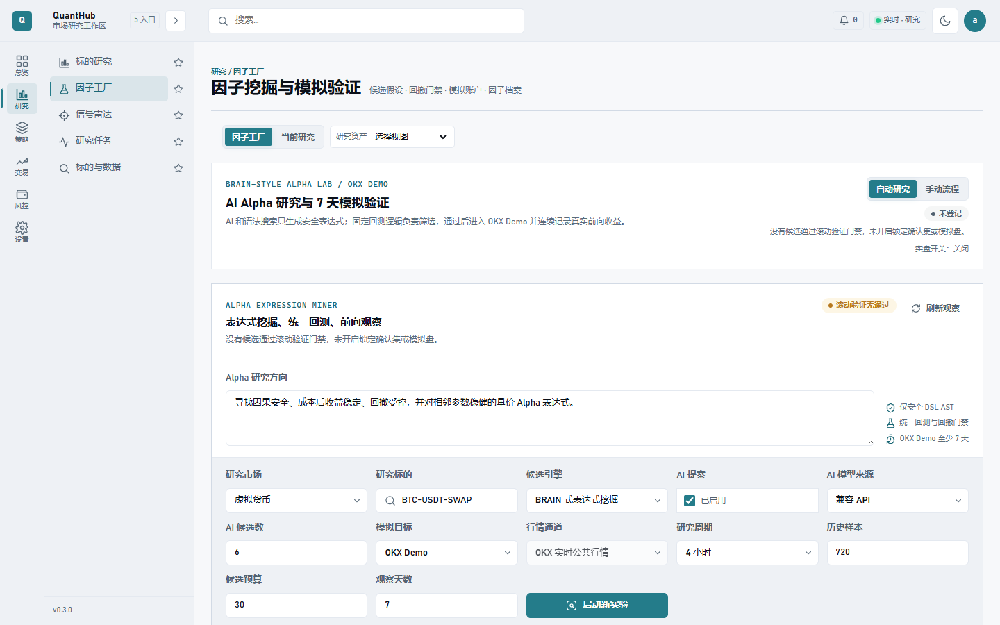

# QuantHub

[English](README.md) | [中文](README.zh-CN.md)

> A local-first quantitative research, strategy validation, and simulated trading workbench for individual investors and quantitative researchers.

QuantHub unifies comprehensive market evaluation, factor validation, AI research evidence, strategy backtesting, signal review, simulated trading, account ledgers, and operational controls in one Web application. It is built with React and FastAPI, supports China A-shares, US equities, crypto assets, and MT5 data, and can be extended through strategy plugins.




## Project Video

[](https://www.bilibili.com/video/BV1uW8B6KEBW)

> The full walkthrough covers research traceability, workspace profiles, streaming reports and auditability, factor-research safety checks and seven-day gates, financial, valuation, news, and macro inputs, signal review, simulated ledgers, local startup, and safety boundaries. [Watch on Bilibili](https://www.bilibili.com/video/BV1uW8B6KEBW)

> [!WARNING]
> QuantHub is a research and simulated-execution tool. Live trading is disabled by default. Nothing produced by this project is investment advice. Before connecting a real account, independently validate data, strategies, risk controls, and compliance requirements.

> [!IMPORTANT]
> The current release targets local single-user research and simulated execution. Multi-user isolation for positions, signals, simulated orders, ledgers, and global search is still being strengthened. Read the P0 isolation requirements in [Product Usability and Reporting Requirements](docs/PRODUCT_USABILITY_AND_REPORT_REQUIREMENTS.md) before a production multi-user deployment.

## Highlights

- **One multi-market workbench:** Manage A-shares, US equities, crypto assets, MT5 data, and strategies from one workspace. Each market uses its configured primary provider, and provider failures are explicit rather than silently falling back across sources.
- **Comprehensive research:** Launch quantitative snapshots, news AI, price-structure AI, and model consensus in one workflow and write results to a shared research record.
- **Rigorous factor validation:** Evaluate trend, reversal, price-volume, and risk factors with training, holdout, rolling out-of-sample windows, drawdown and trade-count gates, and cost stress tests.
- **Factor Factory:** Generate candidates from BRAIN-style rules, manual JSON batches, libraries, or AI proposals. Expressions are checked against an AST allow-list, future-data constraints, parameter boundaries, duplicate hashes, and observed signal correlation.
- **Real observation gate:** A winning factor must pass a seven-calendar-day observation period in OKX Demo or a local isolated simulation before research acceptance.
- **Review-first execution:** Signals enter a review center before simulated orders and the account ledger. FIFO trade analytics calculate win rate, profit factor, payoff ratio, holding duration, long and short differences, and fee erosion.
- **Configurable AI:** Configure DeepSeek, OpenAI, or compatible providers, select a model, and test connectivity in System Settings. AI submits hypotheses and analyses; it does not change statistical results.
- **Local-first safety:** SQLite is the default store. Windows credentials use DPAPI and are not echoed in the UI. Live trading is disabled by default, while the OKX Runner starts in read-only shadow mode.
- **Operational controls:** Automated tasks, incidents, backups, access controls, and runtime health are part of the product.

## Workspace Overview

| Workspace | Primary capabilities |
| --- | --- |
| Overview | Account value, holdings, watchlist, market status, action queue, and PA decision summary |
| Research | Comprehensive evaluation, factor validation, and research tasks |
| Strategies | Installed strategy runs, reproducible experiments, and strategy portfolios |
| Execution | Signal review, simulated trading, account ledger, and price alerts |
| Operations | Instruments and data, job scheduling, incidents, access controls, backups, and system settings |

Built-in strategies cover sentiment analysis, news scanning, stock selection, SuperTrend, morning briefs, real-time analysis, OKX grids, AlphaGPT, PA Agent, and AlphaMaster.

## Safety and Product Boundaries

- Factor Factory DSL candidates currently operate on **single-instrument OHLCV time series**. Broad cross-sectional fields, industry ranking, and other WorldQuant-style operations require a stable cross-sectional data layer.
- Similarity filtering compares formula structure and observed signal correlation for the same target. It does not claim factors are intrinsically equivalent across markets or frequencies.
- Seven-day simulated-account results are research evidence, not live-trading authorization. Live trading requires separate configuration, human approval, and a longer observation period.
- The frontend never silently writes demo positions or watchlists. Real-data failures are explicit and do not render replacement values as market data.

## Technology Stack

- Frontend: React 18, TypeScript, Vite, React Router, Vitest
- Backend: FastAPI, Pydantic, SQLAlchemy, Alembic
- Data: Pandas, NumPy, PyArrow, SQLite / PostgreSQL
- Engineering: uv workspace, plugin strategies, domain-oriented APIs, and PowerShell lifecycle scripts

## Quick Start

### Prerequisites

- Python 3.11 or 3.12
- Node.js 18+
- [uv](https://docs.astral.sh/uv/)
- PowerShell for one-command startup on Windows

### 1. Clone the Project

```bash
git clone https://github.com/1634594707/QuantHub.git
cd QuantHub
```

### 2. One-Command Windows Startup

The launcher validates the runtime, syncs dependencies, checks ports and API health, and writes logs to `logs/launcher/`. It starts the Web workbench, unified API, and headless OKX Runner together.

For the first startup, or after dependency changes:

```powershell
# Safe default: Runner uses read-only shadow mode and never submits orders.
powershell -ExecutionPolicy Bypass -File tools/start-quanthub.ps1
```

For routine development after dependencies are installed:

```powershell
# Read-only research and trading-status view.
powershell -ExecutionPolicy Bypass -File tools/start-quanthub.ps1 -SkipSync

# OKX Demo integration: starts Web, API, and Demo Runner.
powershell -ExecutionPolicy Bypass -File tools/start-quanthub.ps1 -SkipSync -Demo

# Start Web and API only; do not start the Runner.
powershell -ExecutionPolicy Bypass -File tools/start-quanthub.ps1 -SkipSync -SkipRunner
```

After startup, open:

- Web workbench: <http://127.0.0.1:5173>
- API documentation: <http://127.0.0.1:8001/docs>
- Health check: <http://127.0.0.1:8001/health>

The OKX Runner listens on `127.0.0.1:8103`. It is not exposed to the browser and has no independent UI. The Web app reaches it only through `/api/trading/*` on the unified API.

Before switching between `shadow`, `Demo`, and `-SkipRunner`, stop existing processes. Otherwise the launcher can reuse an existing process whose environment does not match the new command.

```powershell
powershell -ExecutionPolicy Bypass -File tools/stop-quanthub.ps1
```

### 3. Manual Startup

Install base dependencies:

```bash
uv sync --locked
npm --prefix web install
```

Start the API:

```bash
uv run uvicorn apps.api.main:app --host 127.0.0.1 --port 8001
```

Start the frontend in another terminal:

```bash
npm --prefix web run dev
```

Start the default read-only OKX Runner in a third terminal:

```bash
uv run uvicorn apps.okx_runner.main:app --host 127.0.0.1 --port 8103
```

Vite proxies `/api` to `http://127.0.0.1:8001`, and the unified API reaches the Runner at `http://127.0.0.1:8103`. Research pages work when only Web and API are running. Trading surfaces report `TRADING_RUNNER_UNAVAILABLE` until the Runner is available.

### 4. Docker Image

Release images are published to GitHub Container Registry. The image serves the Web workbench and API on the same port and persists SQLite data at `/data`:

```bash
docker run --name quanthub -p 8080:8080 -v quanthub-data:/data ghcr.io/1634594707/quanthub:latest
```

Open <http://127.0.0.1:8080> after startup. The health endpoint is <http://127.0.0.1:8080/health>.

## Optional Capabilities

The base installation starts the Web workbench. Install an extra only when a market or analysis capability needs it:

```bash
# A-share data and Chinese sentiment analysis
uv sync --locked --extra a_shares

# Crypto data sources
uv sync --locked --extra crypto

# OpenAI-compatible LLM features
uv sync --locked --extra ai

# Backtrader backtesting engine
uv sync --locked --extra backtest
```

Extras can be combined:

```bash
uv sync --locked --extra a_shares --extra ai --extra backtest
```

## Configuration

### Local Environment Variables

Basic quantitative analysis and factor validation do not require an API key. To enable AI research evidence, configure DeepSeek, OpenAI, or an OpenAI-compatible provider in **System Settings -> Model Providers**, or copy the environment template:

```powershell
Copy-Item apps/api/.env.example apps/api/.env
```

```dotenv
DEEPSEEK_API_KEY=your-key-here
# or
OPENAI_API_KEY=your-key-here
# or
QUANTHUB_CUSTOM_LLM_API_KEY=your-key-here
```

The UI configures API base URLs, default models, timeouts, retries, and connectivity checks. Keys are written only to the runtime environment and never echoed. `apps/api/.env` is ignored by Git. Never commit API keys, database passwords, exchange keys, or access tokens.

### Local OKX Credentials

Open **System Settings -> OKX Connection**, enter API Key, Secret Key, and API Passphrase, then run a read-only connection test. For initial integration, grant only **Read** permissions and create a dedicated key in OKX **Demo Trading**.

Runner defaults:

- `QH_RUNNER_ENVIRONMENT=shadow`: read-only shadow mode; no orders.
- `QH_RUNNER_ENVIRONMENT=demo`: explicitly connects to the OKX Demo Trading environment.
- Live use additionally requires `QH_RUNNER_LIVE_APPROVED=1` and should only be enabled after a Demo observation period and human acceptance.

### Main Configuration Files

| File | Purpose |
| --- | --- |
| `configs/base.yaml` | Global switches, cache, signal weights, alerts, LLM, and backtest configuration |
| `configs/a_shares.yaml` | A-share data sources and strategy configuration |
| `configs/us_stocks.yaml` | US-equity primary provider and diagnostics-provider configuration |
| `configs/crypto.yaml` | Crypto data sources and strategy configuration |
| `configs/mt5.yaml` | MT5 data and AlphaMaster configuration |
| `configs/ai_analysis.yaml` | PA Agent analysis configuration |
| `configs/portfolio.yaml` | Portfolio and account configuration |

QuantHub supports `local`, `lan`, and `postgresql` deployment modes. LAN and PostgreSQL deployments must explicitly configure CORS, authentication tokens, and database connections. See [deployment and database migrations](docs/DEPLOYMENT.md).

## Project Layout

```text
apps/
  api/          FastAPI gateway and domain APIs
  dispatcher/   Signal aggregation, risk controls, and order routing
  okx_runner/   Headless OKX execution, risk, and reconciliation service
  scheduler/    Automated task definitions
core/           Shared configuration, market data, signals, backtesting, alerts, and LLM capabilities
strategies/     A-share, crypto, AI-analysis, and MT5 strategy plugins
web/            React and Vite Web client
configs/        Market, portfolio, and deployment configuration
data/           Local market data and runtime data
docs/           Architecture, deployment, quality, and operations documentation
tools/          Lifecycle, backup, migration, recovery, and strategy-scaffolding tools
tests/          Backend product-workflow tests
```

## Development and Validation

Install development tools and Git hooks:

```bash
uv sync --locked --extra dev
uv run pre-commit install
```

Run backend tests:

```bash
uv sync --locked --group test
uv run --frozen python -B tools/run_backend_tests.py
```

Run frontend tests, type checks, and the production build:

```bash
npm --prefix web test
npm --prefix web run typecheck
npm --prefix web run build
```

Run data and credential gates:

```bash
uv run --frozen python -B tools/check_fake_data.py
uv run --frozen python -B tools/check_product_secrets.py --product okx-runner
```

Command references, test coverage, and historical browser evidence live in `docs/README.md`, `docs/QUALITY_GATES.md`, and `docs/Plan/evidence/`.

## Documentation

- [Documentation index](docs/README.md)
- [Product Usability and Reporting Requirements](docs/PRODUCT_USABILITY_AND_REPORT_REQUIREMENTS.md)
- [v0.4.0 release notes](docs/releases/v0.4.0.md)
- [v0.3.0 release notes](docs/releases/v0.3.0.md)
- [AI factor discovery roadmap](AI_FACTOR_DISCOVERY_ROADMAP.md)
- [Architecture](docs/ARCHITECTURE.md)
- [Function boundaries](docs/FUNCTION_BOUNDARIES.md)
- [Deployment and database migrations](docs/DEPLOYMENT.md)
- [Quality gates](docs/QUALITY_GATES.md)
- [Upgrade and extension](docs/UPGRADE.md)
- [Data quality](docs/DATA_QUALITY.md)

## Contributing

Use Issues for defects, feature requests, and data-source adapters. Before opening a pull request, run the backend tests, frontend tests, type checks, and production build relevant to the change.

## License

QuantHub is licensed under AGPL-3.0-or-later. Upstream components in `strategies/mt5/alphamaster/_upstream` retain their original licenses and copyright notices.
